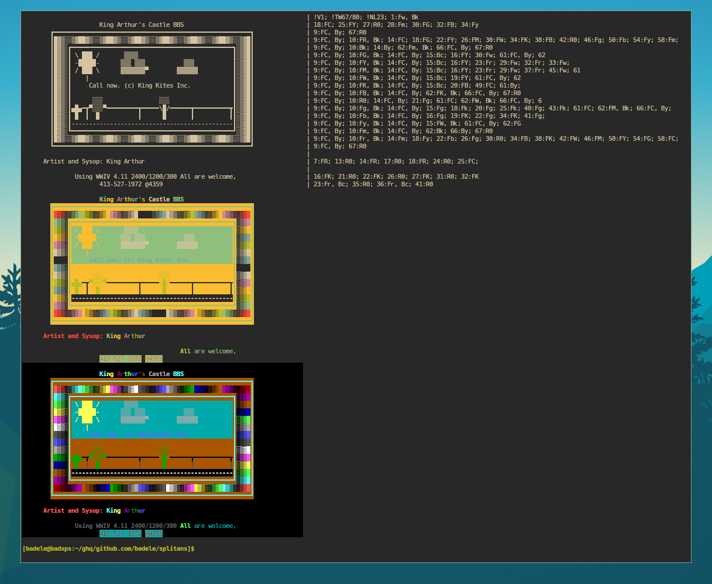

Splitans is a tokenization tool that parses ANSI files and separates ANSI
sequences from text. You can save the stdout output to a file with the `.neo`
extension. The `neotex` format is simple: text content on the left, ANSI
sequences on the right, separated by `|`. The `neotex` format allows you to view
the content without requiring an ANSI terminal.

It is also possible to export to various formats, such as ANSI, table, stats or
JSON.

## Usage

By default, `splitans` converts UTF-8 ANSI to UTF-8 `neotex` format and outputs
to stdout.

```bash
# Convert 16colors to UTF-8 ANSI (terminal)
curl -s https://16colo.rs/pack/1990/raw/WWANS157.ANS | ./splitans -e cp437 -F ansi

# Convert 16colors to UTF-8 ANSI with true VGA colors (disable terminal theme)
curl -s https://16colo.rs/pack/1990/raw/WWANS157.ANS | ./splitans -e cp437 -F ansi -v

# Convert 16colors legacy ANSI to neotex
curl -s https://16colo.rs/pack/1990/raw/WWANS157.ANS | ./splitans -e cp437 > /tmp/WWANS157.neo
less -S /tmp/WWANS157.neo

# Convert neotex to ANSI
./splitans /tmp/WWANS157.neo -f neotex -F ansi
./splitans /tmp/WWANS157.neo -f neotex -E cp437 -F ansi

# Convert 16colors to UTF-8 plaintext
./splitans /tmp/WWANS157.neo -f neotex -F plaintext
cat /tmp/WWANS157.neo | colrm 80

# Copy ANSI to termbin.com
cat /tmp/WWANS157.neo | ./splitans -f neotex -F ansi | nc termbin.com 9999
curl -s https://termbin.com/w7sp

# Display ANSI tokens in other formats
curl -s https://16colo.rs/pack/1990/raw/WWANS157.ANS | ./splitans -e cp437 -F json
curl -s https://16colo.rs/pack/1990/raw/WWANS157.ANS | ./splitans -e cp437 -F table
curl -s https://16colo.rs/pack/1990/raw/WWANS157.ANS | ./splitans -e cp437 -F stats
```

## Output Examples

Here are the results of the `splitans` commands, in order:

- The `neotex` format
- The 16-color ANSI format (uses the terminal theme)
- The true color ANSI format (overrides the terminal theme)



## Miscellaneous

#### Convert all ANS files to neotex

```bash
# Convert one ANSI file to neotex
just neotex-from-ansi "<FILENAME>"

# Convert all *.ANS files to neotex
just neotex-all-delete "<PATH>"
just neotex-all-from-ansi "<PATH>"
```

## Sources

- Resources
  - https://16colo.rs
  - https://wezterm.org/escape-sequences.html#graphic-rendition-sgr
  - https://vt100.net/docs/vt510-rm/chapter4.html
  - https://invisible-island.net/xterm/ctlseqs/ctlseqs.html
  - https://ecma-international.org/wp-content/uploads/ECMA-48_5th_edition_june_1991.pdf
- Logo Font
  - https://n0namen0.github.io/CODEF_Ansi_Logo_Maker/ (ZETRAX)
